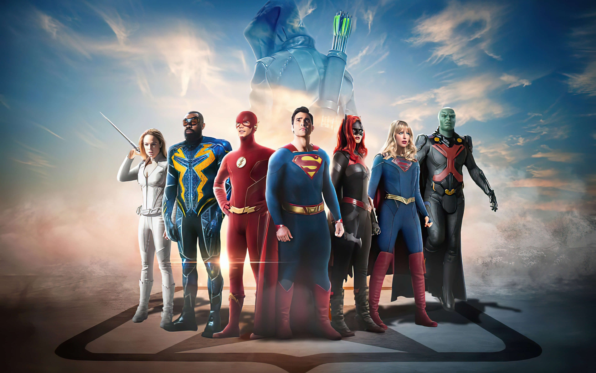
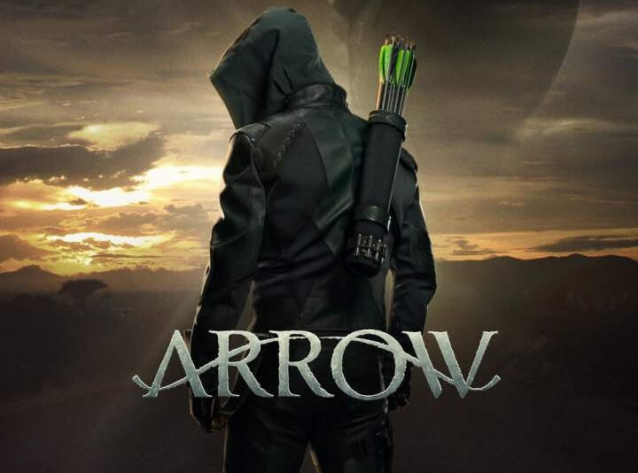
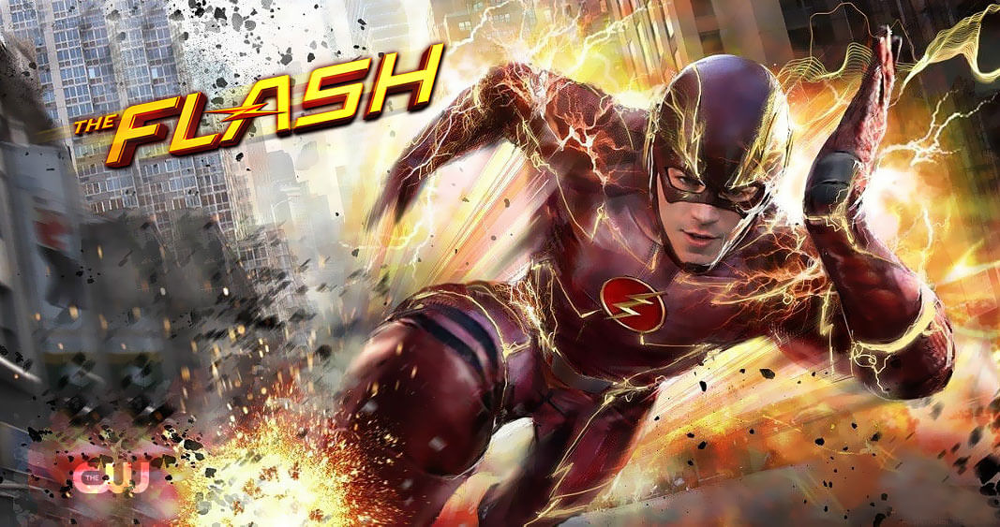
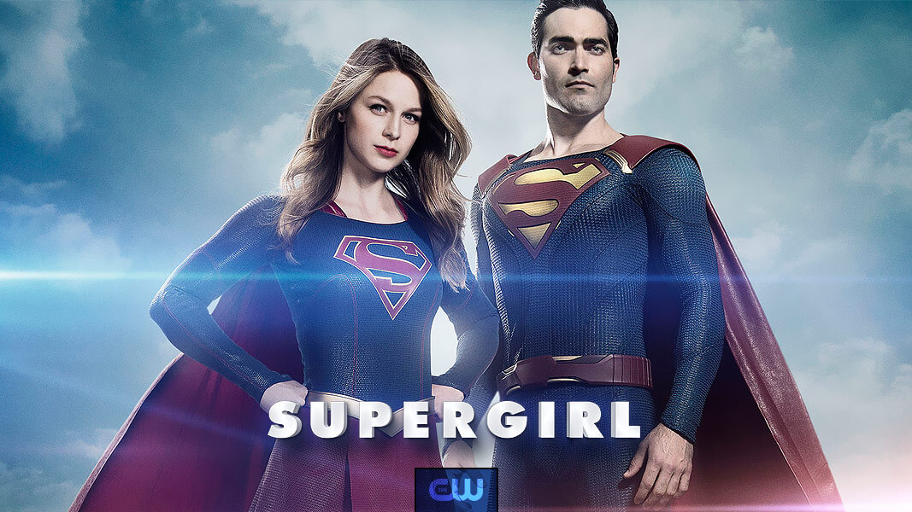

# Diversity in the Arrowverse

A tribute to racial inclusivity in the Arrowverse.

It's been a decade since [Arrow](https://arrow.fandom.com/wiki/Arrow) was brought to  our screens in 2012. Portrayed by [Stephen Amell](https://arrow.fandom.com/wiki/Stephen_Amell), the bow-and-arrow strapping, hood-wearing, vigilante quickly gained popularity and the show established itself as a household name. This success led to the inception of more [shows](https://en.m.wikipedia.org/wiki/Arrowverse#Television_series) tightly woven into the shared multiverse we now know as the [Arrowverse](https://arrow.fandom.com/wiki/Arrowverse), spanning across multiple universes with a diverse ensemble of superheroes, supervillains, and super supporting characters we've all grown to super love.

With the Arrowverse nearing its conclusion as most of its series have aired their finals, let's take a look at how each show in the Arrowverse uses diverse characters to tackle the social issue of racism and bring us a racially inclusive character set.

## Table of Contents

Contents

1. [Arrow](#arrow)
2. [The Flash](#the_flash)
3. [Supergirl](#supergirl)
4. [Legends of Tomorrow](#legends_of_tomorrow)
5. [Black Lightning](#black_lightning)
6. [Batwoman](#batwoman)

<h2 id="arrow"><a href="https://arrow.fandom.com/wiki/Arrow">Arrow (October 10, 2012 - January 28, 2020)</a></h2>

**[John Diggle/Spartan](https://arrow.fandom.com/wiki/John_Diggle):** Created specifically for the show, this Black character was given capabilties designed to make him an equal of the series' White [lead character](https://arrow.fandom.com/wiki/Oliver_Queen).

[Curtis Holt/Mister Terrific](https://arrow.fandom.com/wiki/Curtis_Holt), [Rene Ramirez/Wild Dog](https://arrow.fandom.com/wiki/Rene_Ramirez), [Emiko Queen/Green Arrow](https://arrow.fandom.com/wiki/Emiko_Adachi), [Connor Hawke](https://arrow.fandom.com/wiki/Connor_Hawke), and [Mar Novu/The Monitor](https://arrow.fandom.com/wiki/Mar_Novu), among others, are all examples of the racially diverse characters featured in the series.

<h2 id="the_flash"><a href="https://arrow.fandom.com/wiki/The_Flash_(The_CW)">The Flash (October 7, 2014 - present)</a></h2>

**[Iris West-Allen](https://arrow.fandom.com/wiki/Iris_West-Allen):** Although White in the comics, this pivotal character, who is the love interest of the [main protagonist](https://arrow.fandom.com/wiki/Barry_Allen_(Earth-1)) and later becomes co-leader of [Team Flash](https://arrow.fandom.com/wiki/Team_Flash), was cast as a Black woman for the series, opening doors for more characters to be cast as members of the [West family](https://arrow.fandom.com/wiki/West_family).

**[Cisco Ramon/Vibe/Mecha-Vibe](https://arrow.fandom.com/wiki/Cisco_Ramon):** Another important member of Team Flash is the genius responsible for designing all of our favourite heroes' suits, gizmos, and of course giving  the [metavillains](https://dc.fandom.com/wiki/Flash_Villains) the team faces [cool names](https://comicbook.com/dc/amp/news/the-flashs-cisco-top-names-super-cut/). This beloved character is portrayed by Colombian-American actor [Carlos Valdes](https://arrow.fandom.com/wiki/Carlos_Valdes).

Other racially diverse characters in the show include [Cecile Horton](https://arrow.fandom.com/wiki/Cecile_Horton), [Eva McCulloch/Mirror Monarch](https://arrow.fandom.com/wiki/Eva_McCulloch), [Allegra Garcia](https://arrow.fandom.com/wiki/Allegra_Garcia), and [Chester P. Runk](https://arrow.fandom.com/wiki/Chester_P._Runk).

<h2 id="supergirl"><a href="https://arrow.fandom.com/wiki/Supergirl">Supergirl (October 26, 2015 - November 9, 2021)</a></h2>

While I wasn't a regular viewer of this Arrowverse series myself, Supergirl is probably the most racially inclusive, with character representation across all races, human or alien. 

<h2 id="legends_of_tomorrow"><a href="">Legends of Tomorrow (January 21, 2016 - March 2, 2022)</a></h2>

When it comes to challenging social injustices such as systematic racism and racial biases, I believe this show takes the trophy.

The [Legends](https://arrow.fandom.com/wiki/Legends) are a diverse team of superheroes travelling through time  to preserve the timeline. During some of their quests, they travel back in time to some of the most racist historical eras, questioning the social injustices they meet along the way.

<h2 id="black_lightning"><a href="https://arrow.fandom.com/wiki/Black_Lightning">Black Lightning (January 16, 2018 - May 24 2021)</a></h2>

Consisting of a mostly Black cast, this DC show is set in a Black community and explores issues faced in black communities, such as gang violence, [metal detectors in schools](https://www.schoolsecurity.org/trends/school-metal-detectors/), and government targeting of minority communities.

One of the main characters, [Anissa Pierce/Thunnder/Blackbird](https://arrow.fandom.com/wiki/Anissa_Pierce), who is the daughhter of the [titular character](https://arrow.fandom.com/wiki/Jefferson_Pierce), becomes involved in an interracial relationship with Asian [Grace Choi/Shay Li Wylde](https://arrow.fandom.com/wiki/Grace_Choi). The character is also the [first Black lesbian superhero on TV](https://ew.com/tv/2018/01/30/black-lightning-anissa-nafessa-williams-interview/).

The show's archvillain, [Tobias Whale](https://arrow.fandom.com/wiki/Tobias_Whale), is a Black albino man, whom the creators of the show use to expose the social and cultural [challenges](https://en.m.wikipedia.org/wiki/Persecution_of_people_with_albinism) faced by people with albinism, as well as discrimination against Black people by other Black people.

<h2 id="batwoman">Batwoman (October 6, 2019 - March 2022)</h2>

Notable for producing [television's first openly gay superhero](https://www.nbcnews.com/news/amp/ncna1063441) and winning multiple LGBTQ [awards](https://www.imdb.com/title/tt8712204/awards/?mode=desktop&ref_=m_ft_dsk), this show also hosts racially diverse characters, including two more Black superheroes in [Ryan Wilder/Batwoman 2.0](https://arrow.fandom.com/wiki/Ryan_Wilder) and [Sophie Moore](https://arrow.fandom.com/wiki/Sophie_Moore), and Asian [Mary Hamilton/Poison Ivy](https://arrow.fandom.com/wiki/Mary_Hamilton).

[Luke Fox Jr.](https://arrow.fandom.com/wiki/Luke_Fox), who serves as the guardian of [Wayne Tower](https://arrow.fandom.com/wiki/Wayne_Tower_(Earth-1)) and a member of [Team Batwoman](https://arrow.fandom.com/wiki/Batwoman%27s_team_(Earth-1)), later becomes [Batwing](https://en.m.wikipedia.org/wiki/Batwing_(DC_Comics)), Batman's Black counterpart.
